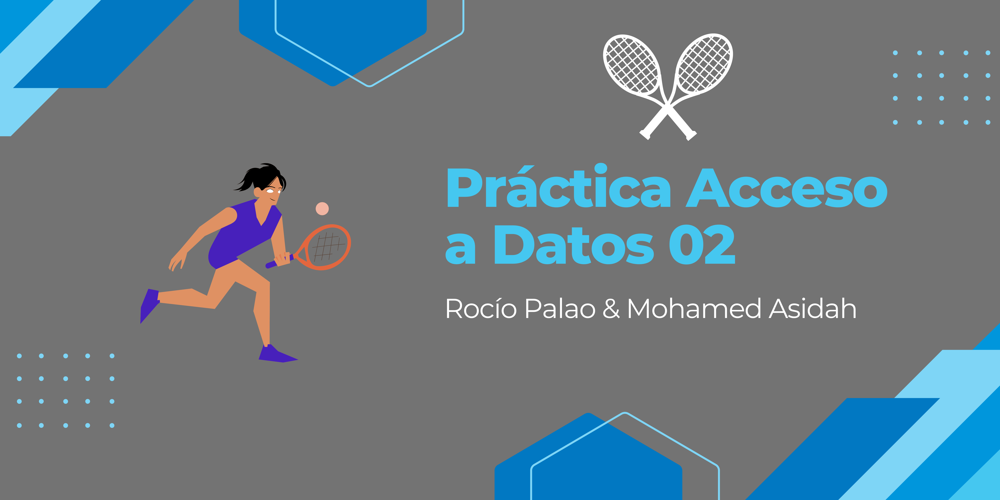

<h1 align="center">TennisLab🎾🎾</h1>
<h2 align="center">Práctica Accesso a Datos 02</h2>

----

 

## Autores💻:
Rocío Palao🙋🏻‍♀️ & Mohamed Asidah🙋🏽‍♂️

### Proyecto:
Proyecto sobre la administración de una tienda de tennis, que realiza distintos tipos de servicios y venta de produtos.
Video de youtube: https://youtu.be/D0cRXdlMZu4

 

##### GitHub Proyecto

 

----
##### GitHub Personal:
- Rocío:
 

- Mohamed:
 

